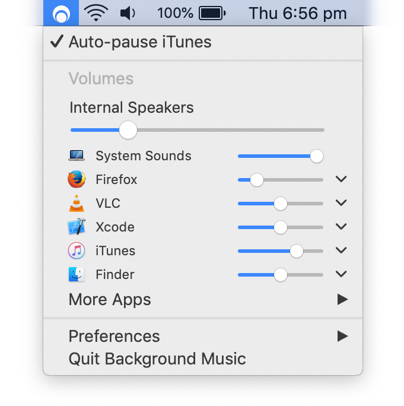

<!-- vim: set tw=120: -->


# Background Music
##### OS X audio utility



- Automatically pauses your music player when other audio starts playing and unpauses it afterwards
- Per-application volume, boost quiet apps
- Record system audio <br>
<br>
- No restart required to install
- Runs entirely in userspace

**Version 0.1.0**, first release. Probably very buggy. Pretty much only tested on one system (a MacBook running OS X
10.11 using the built-in audio device).

**Requires OS X 10.10+**. Might work on 10.9, but I haven't tried it.

## Auto-pause music

Background Music can pause your music player app when other audio starts playing and unpause it afterwards. The idea is
that when I'm listening to music and pause it to watch a video or something I always forget to unpause it afterwards. So
this keeps me from wearing headphones for hours listening to nothing.

So far only iTunes, Spotify and VLC are supported, but adding support for a music player should only take a few minutes
(see `BGMMusicPlayer.h`). If you don't know how to program, or just don't feel like it, create an issue and I'll try to
add it for you.

## App volumes

Background Music has a volume slider for each app running on the system. I mostly use this to boost quiet apps above
their normal maximum volume.

## Recording system audio

With Background Music running, open QuickTime Player and go `File > New Audio Recording...` (or movie/screen). Then
click the arrow next to the record button that looks like `⌄` and select `Background Music Device` as the input device.

You should be able to record system audio and a microphone together by creating an [aggregate
device](https://support.apple.com/en-us/HT202000) that combines your input device (usually Built-in Input) with
Background Music Device. You can create the aggregate device using the Audio MIDI Setup utility from
`/Applications/Utilities`.

## Install

No binaries yet, but building should take less than a minute. To build and install everything, clone/download the
project and run the `build_and_install.sh` script. Unfortunately, **it won't build if you don't have Xcode installed**
because xcodebuild doesn't work on its own anymore.

The script restarts the system audio process (coreaudiod) at the end of the installation, so you might want to pause any
apps playing audio.

## Uninstall

- Delete `Background Music.app` from `/Applications`.
- Delete `Background Music Device.driver` from `/Library/Audio/Plug-Ins/HAL`.
- Delete `BGMXPCHelper.xpc` from `/usr/local/libexec` or possibly `/Library/Application Support/Background Music`.
- Pause apps that are playing audio, if you can.
- Restart `coreaudiod`:
  [//]: # ( <sup>(Open `/Applications/Utilities/Terminal.app` and paste the following at the prompt.)</sup> )

  ```shell
  sudo launchctl kill SIGTERM system/com.apple.audio.coreaudiod
  ```
- Go to the Sound section in System Preferences and change your default output device at least once. (If you only have
  one device now, either use `Audio MIDI Setup.app` to create a temporary aggregate device, restart any audio apps that
  have stopped working or just restart your system.)

## Troubleshooting

If Background Music crashes and system audio stops working, open the Sound panel in System Preferences and change your
system's default output device to something other than Background Music Device. If it already is, it might help to
change the default device and then change it back again. Failing that, you might have to uninstall.

## Known issues

- VLC automatically pauses iTunes/Spotify when it starts playing something, but that stops Background Music from
  unpausing your music afterwards. To workaround it, open VLC's preferences, click `Show All`, go `Interface` > `Main
  interfaces` > `macosx` and change `Control external music players` to either `Do nothing` or `Pause and resume
  iTunes/Spotify`.

  Similarly, Skype pauses iTunes during calls. If you want to disable that, uncheck `Pause iTunes during calls` on the
  General tab of Skype's preferences.
- Plugging in or unplugging headphones when Background Music isn't running can silence system audio. To fix it, go to
  the Sound section in System Preferences, click the Output tab and change your default output device to something other
  than Background Music Device.

  This happens when OS X remembers that Background Music Device was your default audio device the last time you last
  used (or didn't use) headphones.
- [A recent Chrome bug](https://code.google.com/p/chromium/issues/detail?id=557620) can stop Chrome from switching to
  Background Music Device after you open Background Music. Chrome's audio will still play, but Background Music won't be
  aware of it.
- Plenty more. Some are in listed in TODO.md.

## Related projects

- [Core Audio User-Space Driver
  Examples](https://developer.apple.com/library/mac/samplecode/AudioDriverExamples/Introduction/Intro.html)
  The sample code from Apple that BGMDriver's based on.
- [Soundflower](https://github.com/mattingalls/Soundflower) - "MacOS system extension that allows applications to pass
  audio to other applications."
- [WavTap](https://github.com/pje/WavTap) - "globally capture whatever your mac is playing—-as simply as a screenshot"
- [llaudio](https://github.com/mountainstorm/llaudio) - "An old piece of work to reverse engineer the Mac OSX
  user/kernel audio interface. Shows how to read audio straight out of the kernel as you would on Darwin (where most the
  OSX goodness is missing)"
- [mute.fm](http://www.mute.fm), [GitHub](https://github.com/jaredsohn/mutefm) (Windows) - Auto-pause music
- [Sound Siphon](http://staticz.com) (non-free) - System/app audio recording, per-app volumes, system audio equaliser
- [Jack OS X](http://www.jackosx.com) - "A Jack audio connection kit implementation for Mac OS X"
- [PulseAudio OS X](https://github.com/zonque/PulseAudioOSX) - "PulseAudio for Mac OS X"
- [eqMac](http://www.bitgapp.com/eqmac) - "System-wide Audio Equalizer for Mac OSX"
- [Zirkonium](https://code.google.com/p/zirkonium/) - "An infrastructure and application for multi-channel sound
  spatialization on MacOS X."

## License

GPLv2 or later


